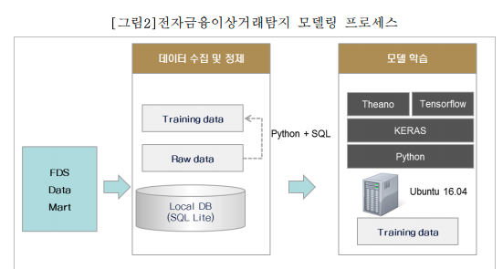
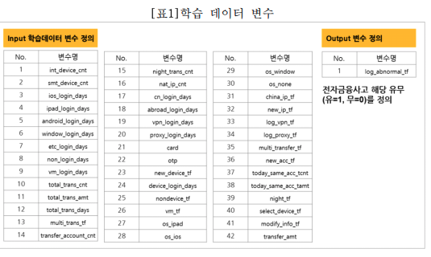
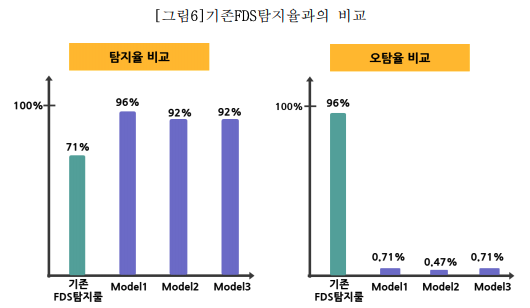

# FDS using DL

[1] 딥러닝을 이용한 전자금융이상거래 탐지 모델 수립 / 전일교

### Motivation

"2015년도를 기점으로 국내 은행은 룰 기반의 FDS 탐지 체계 도입을 통해
전자금융 피해사고를 줄일 수 있었지만, 높은 오탐율로 인한 고객 불편 야기
및 룰을 우회하기 위한 시도들과 다양화되는 전자금융 사기에 능동적으로
대응하는데 한계를 보이고 있다."

### Statement

" DNN(Deep Neural Network)을 활용하여 정상거래로그와 사고거래로그를 지도학습 하고
높은 사고 탐지율과 낮은 오탐율을 달성할 수 있는 이상거래탐지 모델을 수립"

### Method
- DNN 채택
- "이체거래를 기준으로 과거 1년간의 거래를 프로파일링 분석을 통해 Rawdata를 전처리 하여 학습데이터를 구축"
- Data Flow

### Experiment
- Data information
    - 전자금융이체사고 피해를 본 인터넷
뱅킹 사용자 113명의 과거 2년치 전자금융거래로그 27,998건
      
    - 27,998건 거래로그 중 이체거래로그 5,292건의 거래로그를 정상거래
로그(5,163건)와 사고거래로그(129건)로 분류하여 학습 데이터의 기준으로 삼음
      
    - 나머지 22,706건의 데이터는 로그인 거래로그 또는 이용기기저정
이나 연락처정보 변경과 같은 사고와 연관된 거래로그. 이들에 대한 프로파일링 분석
을 통한 데이터 전처리 후 이체거래로그와 함께 학습의 input 변수로 활용
      
    - 아래 같이 42 가지 변수를 학습의 INPUT으로 활용
      
      
- Experimental Result
  - 제안된 3 개의 모델 모두 고전적인 DNN
  
    

----------
[2] 김대현, 거래 기반 블록체인 네트워크 이중지불 탐지에 대한 연구 = A study on transaction oriented blockchain network to detect double spending attack (2019)

### Introduction

- Advantages of blockchain
  - 기존 중앙화 시스템에서는 거래에 제
3의 신뢰 기관이 필요하고 분쟁 시 제3의 기관의 참여가 필요했다면, 블록체
인 기술을 사용하는 분산화 시스템에서는 참여자 간 같은 내용의 원장을 공유
하여 즉각적인 분쟁 해결이 가능  
    
  - 위조 및 변조 공격을 할 경우 공
유된 원장을 통해 기존 정보와의 차이를 확인 가능
  

- 이중지불 공격: 악성 채굴자가 특정 블록체인 넷의 연산 능력 반 이상을 확보 -> 이중지불 공격하여 자금 유출
    

[3] 신무곤, 머신러닝 기반 비트코인 네트워크 불법거래 계정/트랜잭션 탐지 시스템 (2021)

### Introduction

### Motivation
- 블록체인 네트워크, 블록, 거래, 계정 등에 대한 모니터링 및 분석에 대한
연구는 많지 않다
  
  - Difficulties of these studies
    - 비트코인 거래에 사용되는
주소는 개인 정보와는 어떠한 연관성도 가지고 있지 않기 때문에 익명성을
가진다.
    - Tor에서 거래를 진행하게 되면 불법거래 사용자의 추적은 더욱 불가능
  
### Statement

### Methods

### Experiment

### Result